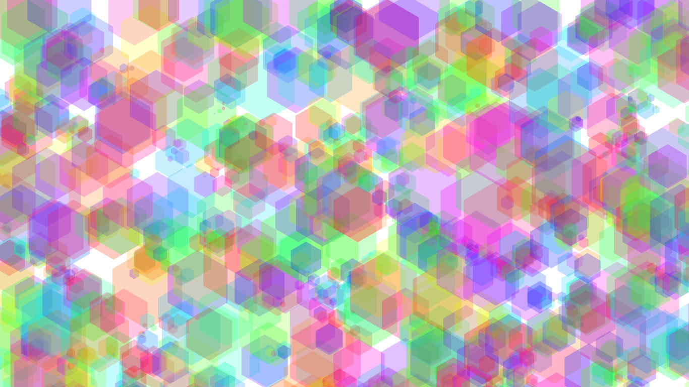

# H3Xes
Program występuje w dwóch wesjach.  
  
Pierwsza napisana jest w Javie w środowisku graficznym Processing.  
Aby ją skompilować wymagane jest środowisko.  
Jest to plik "P_32_Perlin_hex.pde".  
Druga wersja jest napisana w JavaScripcie używając biblioteki  
P5.js i może zostać uruchomiona w przeglądarce pod tym linkiem:  
https://szymon300101.github.io/H3Xes/  
  
Program wykorzystuje szum Prelina i funkcję random()  
do genereowania losowych grafik złożonych z półprzeźroczystych  
kolorowych sześciokątów.  
Program inspirowany jest okładką płyty 'Polaris' zespołu Tesseract.  
  
Z poziomu kodu możliwa jest modyfikacja bardzo wielu parametrów,  
od których zależy wynik. Ich wartości nie są alej idealne, można by  
je nieco opracować.  
Podczas dzialania programu za pomocą SPACJI można wygenerować  
nową grafikę. Klawisz ENTER zapisuje ekran w formacie TIF.  
  
Przykłady:

